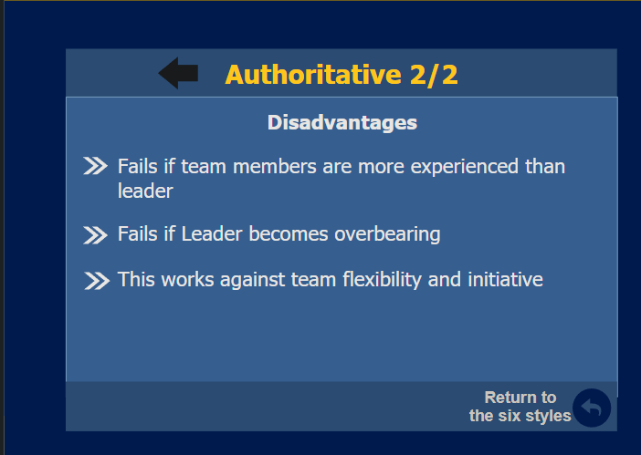

# EI101
## Index
1. [Topic 1 (Feeling Smart)](#Topic-1)
2. [Topic 2 (Assesing your Emotional Intelligence)](#Topic-2)
3. [Topic 3 (Emotional Intelligence in Depth)](#Topic-3)
4. [Topic 4 (The EI Model)](#Topic-4)
5. [Topic 5 (The Open Loop)](#Topic-5)
6. [Topic 6 (Management vs Leadership)](#Topic-6)
7. [Topic 7 (Leadership that Works)](#Topic-7)
8. [Topic 8 (Ethics & Leadership)](#Topic-8)
9. [Topic 9 (Feedback)](#Topic-9)
10. [Topic 10 (Teamwork)](#Topic-10)

----

## Topic-1
#### Book/Street Smart 
**Book Smart**: A book smart person
is a person with high
ability to remember,
calculate, analyze,
and deal with all
types of information.

**Street Smart:** A street smart person
is a person with
distinguished
practical skills that
enable him/her to
deal with day-to-day
interactions and
effectively handle
different real life
situations.
***
#### Characteristics of Emotionally Intelligent Person
**At the personal level:**
- Remain positive despite challenging
situations
- Manage different real-life situations
- Work well under pressure
- Recognize and control one's
emotional reactions
level

**At the Interpersonal**
-  Handle different real-life situations
- Gain the respect of others
- Excel during negotiations
- Handle other people effectively
- Express viewpoints effectively
- Convince and influence other people
#### Social Intelligence
**Social intelligence:** is the ability to understand and
manage the emotions of others.

Social intelligence skills:
- Influence other person's emotions
- Change another person's mood
- Build healthy relationships
- Persuasion

***
> [!NOTE] 
> **The Golden Rule**
A study found that if you do something good for someone
without expecting any kind of compensation, you will be
rewarded someday in the future 

`Reciprocity`
- A soft force in which the tendency of doing something
good for others will increase the chances of others doing
good for you
- *What goes around comes around*

###### When to be tough?
- Someone taking advantage of you
- Inappropriate jokes
- Situations where you need to take a strong position
***
#### Benefits of Emotional Intelligence
- Successfully adapt to changes
- Reach targets while simultaneously maintaining the loyalty of employees
- Understand and uphold their responsibility to the customers, suppliers, networks and society
***
#### Advantages of Emotional Intelligence at Work
##### The People
- Hiring high-quality Employees
- Assigning tasks to the Right Employees
- Creating an Environment of Trust
- Provide effective Training
##### The Work
- Make the Work more Interesting
- Challenge the Employees without overwhelming them
- Provide the right tools to fulfil the Company's goals
- Provide Fair Compensations

#### The Purpose
To achieve an Intelligent workspace, Employees need to understand:
1. The reason behind the work they do.
2. The company's Mission & Goals
***
#### EI at Home
Enables Individuals to :
- Understand & Manage their own Emotions
- Socialize & be empathetic while interacting with family members
- Improve Family relationships
###### Benefits
- Manage your moods
- Teach generosity by receiving as well as giving
- Be generous in expressing love
- Building trust
***

## Topic-2

---
## Topic-3
---
## Topic-4
---
## Topic-5
---
## Topic-6
---
## Topic-7

  

---
## Topic-8
> [!Note]
> **`Ethics`** :  A system of accepted behaviours governed by what is morally right or wrong.
#### Six Pillars of charachter
1. Trustworthiness
2. Respect
3. Responsibility
4. Fairness
5. Caring
6. Citizenship

**Trustworthiness**
- Be Honest, don't cheat
- Have Integrity, `Do what you say`
- Keep Promises
- Be Loyal, stand by your values

**Respect**
- Follow the Golden Rule
- Be accepting of differences
- Be Courteous ~مهذب~ to others
- Deal peacefully with anger
- Be considerate of others' feelings

**Responsibility**
- Do what you're supposed to do
- Be self-disciplined
- Think before you act. Consider the Consequences
- Be accountable for your words, actions

**Fairness**
- Follow the rules
- Be open-minded
- Don't take advantage of others

**Caring**
- Be kind
- Be compassionate
- Express Gratitude
- Forgive Others

**Citizenship**
- Do your share to make your environment better
- Cooperate
- Make choices that protect safety
- Protect the Environment
#### Ethical Dilemmas & Solutions
**Right vs Wrong**
`Right`
- Following rules and regulations.
- Person is fair, just and accurate.
`Wrong`
- Against laws, ethics, morals. 
- Flawed reasoning.

This offers four categories of dilemmas:
**Truth vs Loyalty**
- Honesty is in conflict with loyalty and keeping secrets.
**Justice vs Mercy**
- Applying the law is in conflict with compassion.
**Individual vs Community**
- Your own benefit vs that of the Community
**Short-term vs long-term**
- Immediate results vs Future results
> [!NOTE]
> **`Transparency:`** The leader must be transparent in his/her moral values and ethics in order to uphold a fair and trustworthy reputation.

#### Moral Courage
 We need to have moral courage when faced with unethical issue, by applying the following:
- **Applying values**: understanding and applying your moral values
- **Recognizing risks**: recognize that there might be some potential risks when you apply your moral values
- **Enduring hardships**: being able to endure the negative consequences

#### Solutions
**Code of Conduct**
-  Ethics guide or reference for organizations that individuals can clearly follow.
**Ethics training**
- Training which the organization can provide to the employees to clarify the company's mission and values.

---
## Topic-9

#### Feedback
- Lifeblood of the organization
- Without feedback, problems get worse
- Without feedback, good performance gets lost
- One of the manager's most important tasks
- Effectiveness, satisfaction, productivity

#### Interpersonal Skills
- The future of corporate management is in interpersonal skills
> "When emotionally upset, people cannot remember, attend, learn, or make decisions clearly." - "stress makes people stupid!"
- Praise makes people confident

#### Artful Critique
- Be **specific** about necessary changes
- Be **specific** about reasons for praise (learning)
- Offer a **solution**
- Be **present**, face-to-face and in private
- Be **sensitive**: Empathy
- Be a **partner** as opposed to an adversary
#### Giving Constructive Criticism
- Acknowledge the positive
- Give specific Feedback with solutions
- Return to calm
#### Receiving Criticism
- Listen
- Clarify (don't counterattack)
- Give yourself a break
---
## Topic-10
#### Importance of Teams
Teams have:
- More Talent & Experience
- More Diversity & Resources
- Greater flexibility than individuals
- Superiority of group decision-making than the Brightest individual alone

> [!WARNING]
> Exception to this is when the group lacks harmony or ability to cooperate

Problems in Teams
- Teams are cauldrons of bubbling emotions
- Alliances form
- Clashing agendas get set
- A team's leader must be able to sense and understand the viewpoints of everyone around the table
***
There are 2 ways of managing Teams, `Task Process (The old way)` or `Team Emotional Intelligence(the new way)`
#### Task Process
- Cooperation
- Participation
- Commitment to goal
- Teams should imitate these skills
- `Problem`: pianist/actor

#### Team EI
- Trust among Members
- A sense of group identity
- A sense of group efficacy (~فعالية)
 
#### How to Build Team Emotional Intelligence
- Perspective taking
- Interpersonal understanding
- Self evaluation
- Team-building outings
- Cross-boundary relationships

************
:::::::::::::::::::::::::::::::::::::::
![[tp7-17.png]]
![[tp7-18.png]]
